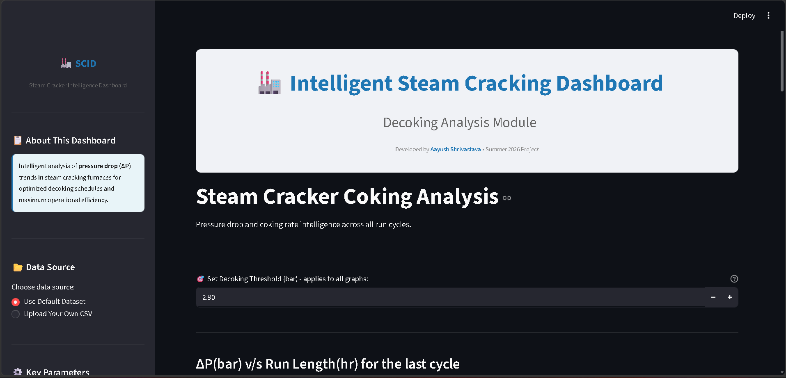
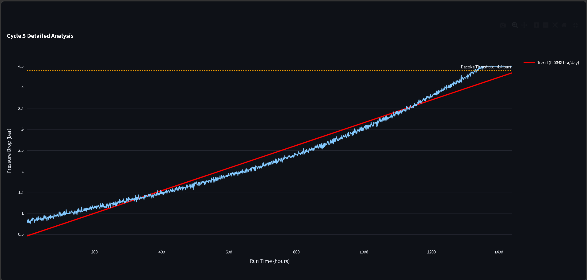
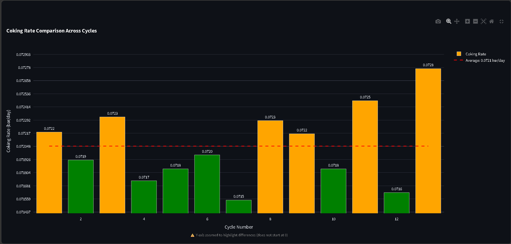
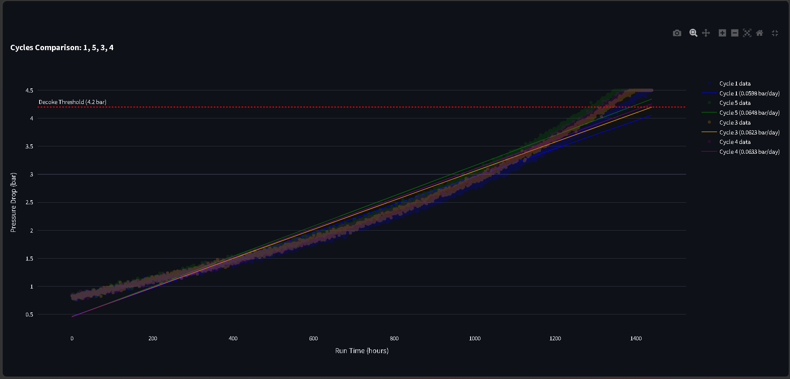
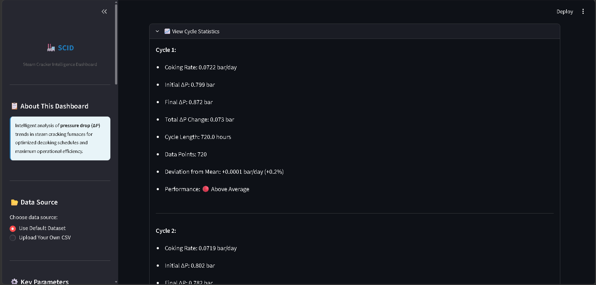
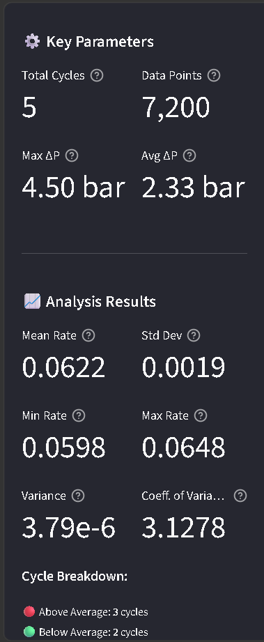
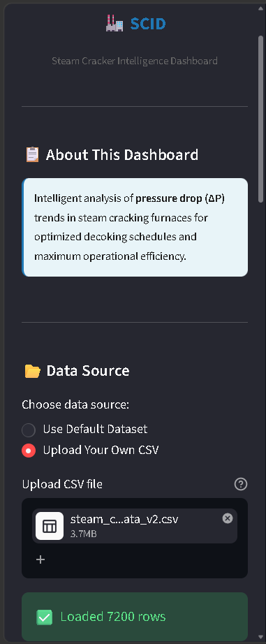

# Steam Cracker Intelligence Dashboard

An interactive web-based analytics platform for steam cracking furnace operations. Designed for chemical engineers and process operators who need real-time decoking analysis and optimization insights without the complexity of full process simulators.

**Built by:** Aayush Shrivastava, Chemical Engineering, BIT Mesra

---

## What It Does

The dashboard provides comprehensive decoking analysis for steam cracking furnaces through three main visualization modules:

| Module | Description |
|--------|-------------|
| Individual Cycle Analysis | Detailed pressure drop vs run length for any selected cycle with linear regression trend fitting |
| Coking Rate Comparison | Statistical bar chart comparing coking rates across all cycles with performance indicators |
| Multi-Cycle Comparison | Interactive overlay of up to 4 cycles with adjustable decoking threshold and real-time statistics |

All modules feature interactive Plotly charts with zoom, pan, and hover capabilities, plus HTML export functionality for reports.

---

## Key Features

### Analytics

- Linear regression modelling for pressure drop prediction
- Automated cycle detection from pressure reset patterns
- Statistical analysis:
  - Mean
  - Standard deviation
  - Variance
  - Coefficient of variance
- Cycle-by-cycle performance categorisation (above/below average)
- Deviation analysis from operational baseline
- Real-time threshold impact assessment

### User Experience

- Interactive Plotly visualisations with full zoom/pan/hover support
- Responsive sidebar with comprehensive operational metrics
- CSV upload support for custom datasets with automatic validation
- Adjustable decoking threshold slider (1.0–6.0 bar range)
- Export charts as HTML for engineering reports
- Expandable cycle statistics sections

### Data Support

- Default synthetic dataset with 13 operational cycles (~1400–1800 data points)
- 35 operational variables spanning pressure, temperature, yield, heat transfer, emissions, and coking metrics
- CSV upload accepts any dataset with `run_length_hours` and `pressure_drop_bar` columns
- Automatic cycle boundary detection for uploaded data

---

## 📸 Dashboard Screenshots

### Main Dashboard Interface

*Complete dashboard interface with sidebar analytics and interactive visualizations*

---

### Individual Cycle Analysis

*Pressure drop vs run length with linear regression trend fitting and decoking threshold overlay*

---

### Coking Rate Comparison

*Statistical comparison of coking rates across all cycles with performance color coding*

---

### Multi-Cycle Comparison

*Interactive overlay of multiple cycles with adjustable threshold and hover tooltips*

---

### Detailed Cycle Statistics

*Comprehensive cycle-by-cycle breakdown with deviation analysis and performance indicators*

---

### Sidebar Analytics Panel

*Real-time operational metrics and statistical analysis results*

---

### Custom Data Upload

*Upload and analyze your own operational data with automatic validation*

---

# Dataset

**Type:** Synthetic operational data based on peer-reviewed literature and industrial parameters

**Simulated Equipment:**  
Ethane/Propane steam cracking furnace, radiant coil section, modern SRT-VI/SCORE/USC type technology, typical Gulf Coast/Middle East operations.

## Operating Conditions

| Parameter | Range |
|-----------|-------|
| Coil outlet temperature | 820–870 °C |
| Coil inlet temperature | 600–650 °C |
| Operating pressure | 1.5–2.5 bar absolute |
| Steam dilution ratio | 0.3–0.5 kg steam/kg feed |
| Feed rate | 20,000–40,000 kg/hr |
| Residence time | 0.12–0.25 seconds |
| Ethylene yield | 28–42 wt% |
| Conversion | 55–75% |

## Coking Characteristics

| Parameter | Value |
|-----------|-------|
| Initial pressure drop (clean coil) | 0.35–0.50 bar |
| Decoking threshold (industry standard) | 2.9 bar |
| Coking rate | 0.05–0.15 bar/day |
| Run length per cycle | 25–45 days |
| Annual cycles | 12–13 |

## Literature Basis

- Zimmermann, H. & Walzl, R. (2009). *Ethylene*. Ullmann's Encyclopedia of Industrial Chemistry. Wiley-VCH. DOI: 10.1002/14356007.a10_045.pub3
- Sundaram, K.M. & Froment, G.F. (1977). *Modeling of Thermal Cracking Kinetics*. Chemical Engineering Science, 32(6), 601–608. DOI: 10.1016/0009-2509(77)80225-X
- Albright, L.F. (1983). *Coke Formation in Pyrolysis Furnaces*. Industrial & Engineering Chemistry Process Design and Development, 22(4), 627–634. DOI: 10.1021/i200023a022

---

# Methodology

## Analysis Pipeline

1. Data preprocessing
   - CSV validation
   - Column checking
   - Missing value handling
   - Type verification

2. Cycle detection
   - Automatic identification of cycle boundaries from pressure drop resets

3. Statistical analysis
   - Linear regression per cycle
   - Coking rate calculation
   - Aggregate statistics

4. Visualisation
   - Interactive Plotly charts
   - Hover details
   - Colour-coded performance indicators

## Key Equations

```text
Coking Rate (bar/day) = Regression Slope (bar/hr) × 24

Coefficient of Variance (%) =
(Standard Deviation / Mean) × 100
```

---

# Project Structure

```text
steam-cracker-intelligence-dashboard/
│
├── README.md
├── requirements.txt
│
├── app.py
│
├── data/
│   ├── steam_cracker_data.csv
│   └──data_generator.py
│
├── src/
│   ├── data_loader.py
│   ├── cycle_detector.py
│   ├── coking_analyzer.py
│   └── visualizations.py
│
├── assets/
│   ├── screenshot1.png
│   ├── screenshot2.png
│   └── screenshot3.png
│
└── scripts/
    └──data_generator.py

```

---

# Requirements

```text
Python 3.11+
streamlit==1.31.0
pandas==2.2.0
plotly==5.18.0
numpy==1.26.3
```

Install dependencies:

```bash
pip install -r requirements.txt
```

---

# How to Run

```bash
git clone https://github.com/Aayush-Shrivastava/steam-cracker-intelligence-dashboard.git

cd steam-cracker-intelligence-dashboard

pip install -r requirements.txt

streamlit run app.py
```

Open your browser to:

```text
http://localhost:8501
```

---

# Usage Guide

## Default Dataset

Launch the application. The sidebar shows **"Use Default Dataset"** selected by default.

You can:

- Explore the three visualisation modules.
- Adjust the decoking threshold using the slider.
- Select individual or multiple cycles for comparison.

---

## Custom CSV Upload

Select **"Upload Your Own CSV"** in the sidebar.

Upload a CSV containing at minimum the following numeric columns:

- `run_length_hours`
- `pressure_drop_bar`

The dashboard automatically detects cycle boundaries and recalculates all statistics.

### Minimum CSV Format

```csv
run_length_hours,pressure_drop_bar
0.0,0.38
1.0,0.41
...
```

Optional columns:

- `cycle`
- `temperature`
- `flow_rate`

---

# Technology Stack

| Category | Technology |
|----------|------------|
| Backend | Python 3.11+ |
| Data Processing | Pandas, NumPy |
| Visualisation | Plotly |
| Web Framework | Streamlit |
| Analysis | Linear Regression, Statistical Modelling |

---

# Scope and Limitations

- Focuses on pressure drop analysis and decoking cycle optimisation.
- Assumes linear coking kinetics (first-order approximation suitable for trend analysis).
- Automatic cycle detection works best with clear pressure drop resets following decoking events.
- Not suitable for actual plant operation decisions or safety-critical calculations.
- This dashboard represents the first step toward a more comprehensive steam cracker intelligence platform, with future development focused on integrating advanced process analytics, predictive modelling, real industrial datasets, and AI-assisted operational decision support.

---

# Future Development

This project is intended as the foundation of a larger Steam Cracker Intelligence Platform. Planned enhancements include:

- Integration of real industrial operating datasets
- Machine learning-based coking rate prediction
- Furnace performance benchmarking
- Heat transfer and energy efficiency analytics
- Yield optimization recommendations
- Predictive maintenance and decoking scheduling

---


# License

MIT License.

Free to use, modify, and distribute with attribution.

---

# Author

**Aayush Shrivastava**

Chemical Engineering, BIT Mesra, Ranchi

- LinkedIn: (https://www.linkedin.com/in/aayush-shrivastava-a5568b346/?lipi=urn%3Ali%3Apage%3Ad_flagship3_profile_view_base_contact_details%3B2bTmIu9xQ82PtiV%2FSFMe3w%3D%3D)
- GitHub: (https://github.com/Aayush-Shrivastava/steam-cracker-intelligence-dashboard)
